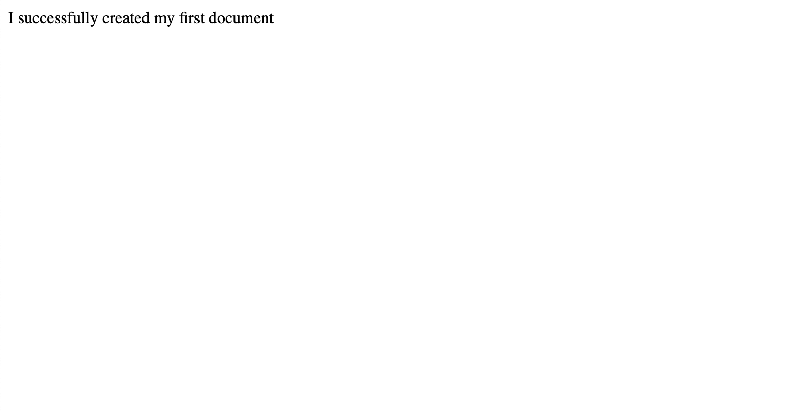

# Lab Instructions: Creating an HTML Document

In this exercise you will you will practice creating a simple HTML document.  

 

## Task 1: Create a valid HTML document that displays a piece of text.

Objectives
- Add the **DOCTYPE**.
- Add the HTML, head and body elements.
- Add the title element.
- Add the text to the body element.

## Final Result

