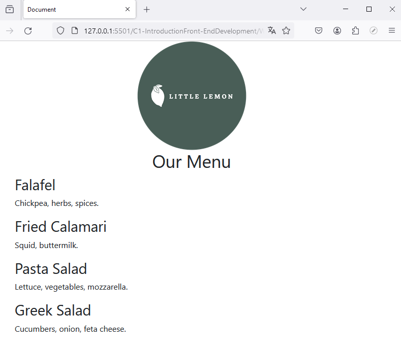
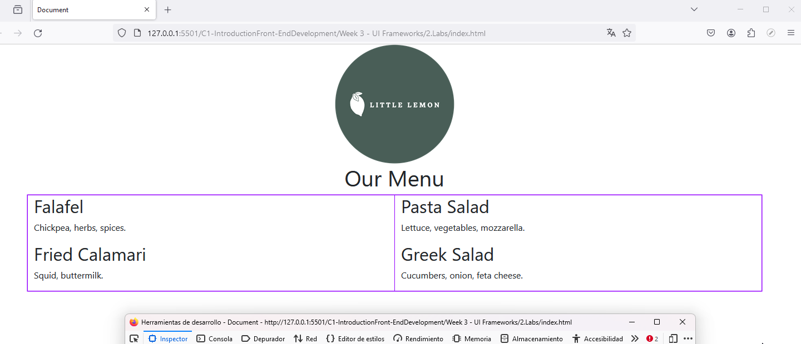

# Working with Bootstrap grid

It is not strictly necessary to use col-12 because it is the default behavior when a specific column class is not specified.

In other words, if no specific column class is provided, the columns will behave as if they have class col-12 by default.

### Final result

  

  

