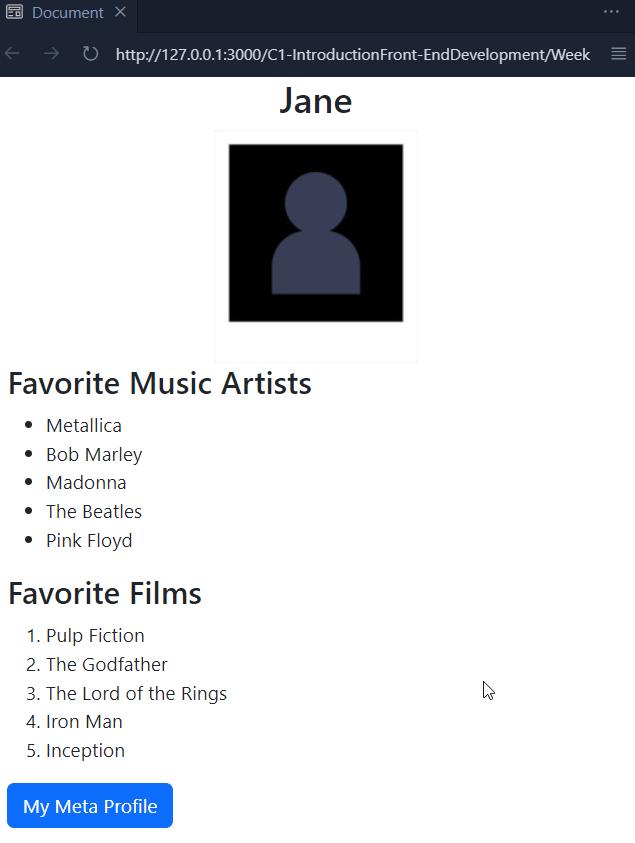
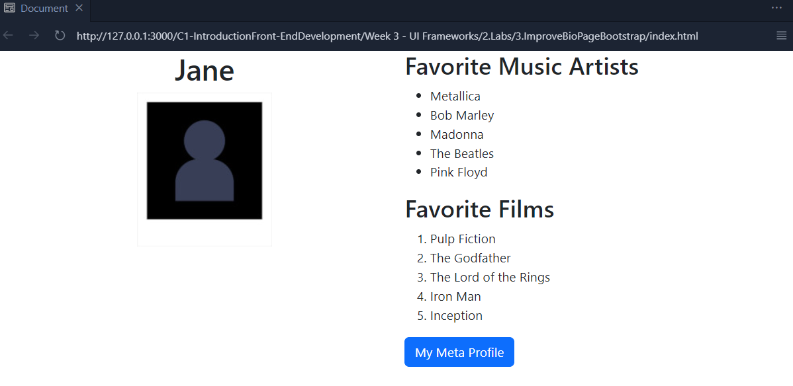

# Improve your Bio page with Bootstrap

### Goal
Use Bootstrap to build your biographical page.

#### Objectives
- Add a Bootstrap Grid to the page.

- Set up the grid so that the content will layout correctly on both mobile and desktop.

- Configure your photo to be responsive.

- Change the Meta profile link to use a Bootstrap button style.
## Final result

  

  

